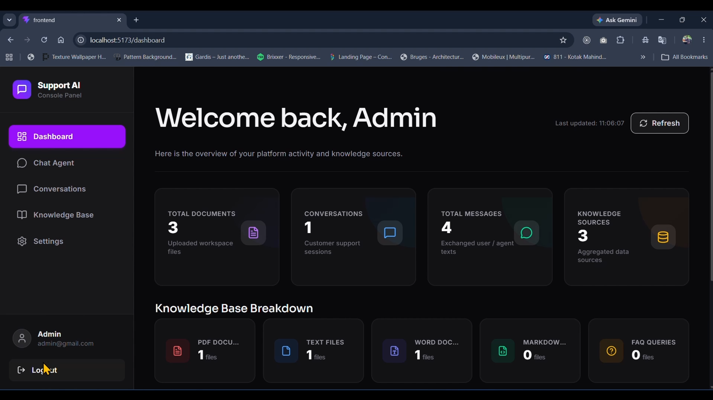
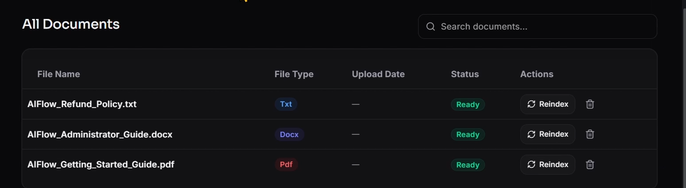
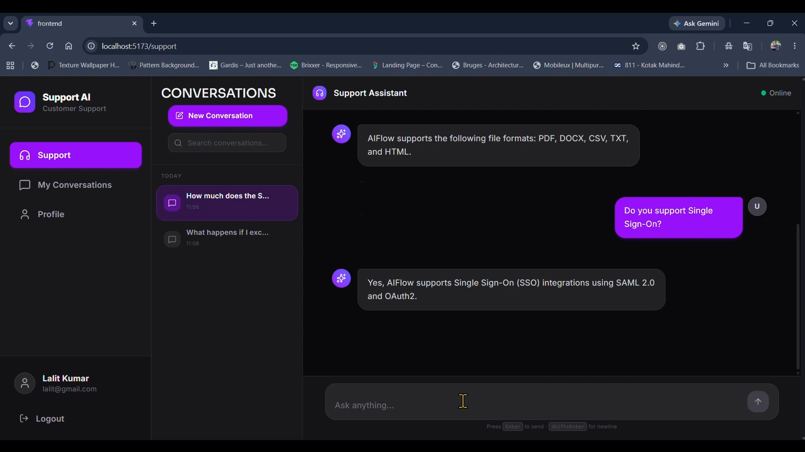
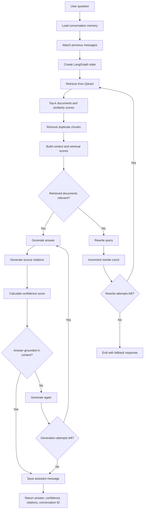
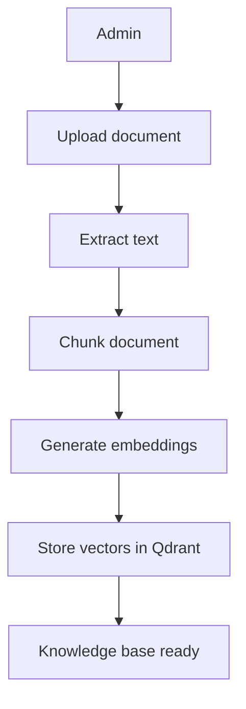
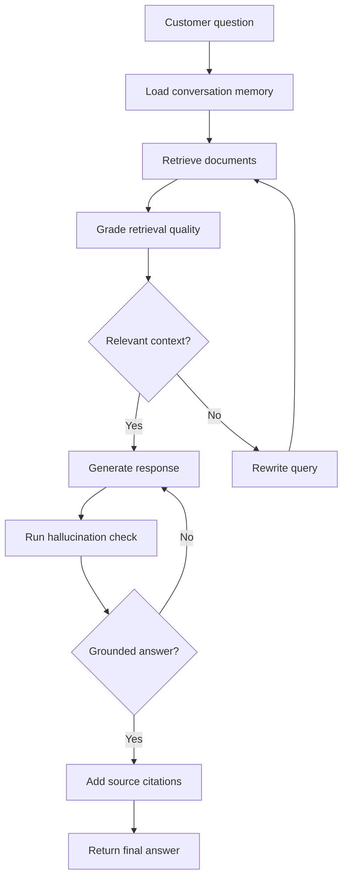
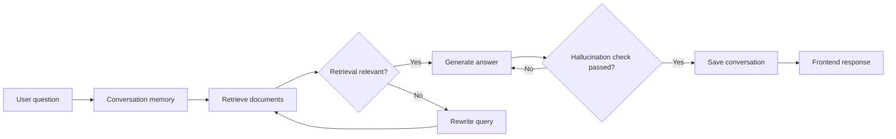
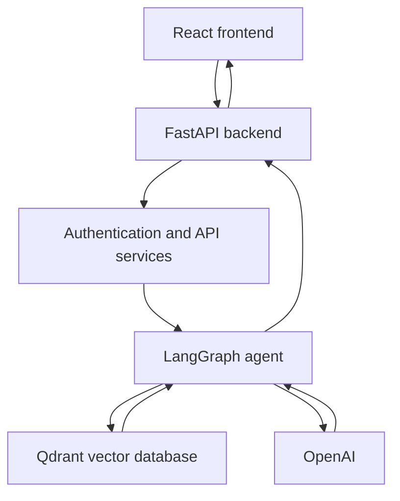

# 🚀 Support AI Platform

> An agentic RAG-powered customer support platform that lets organizations build private AI assistants from their own knowledge base.

---

## 🔗 Demo

### 🎥 Demo Video

[](https://youtu.be/EXOKhftiq_A)

---

## 📸 Screenshots

### Admin Dashboard



### Knowledge Base



### Customer Chat



---

## 📋 Description

Support AI Platform is a full-stack AI customer support application that allows organizations to upload internal documents and instantly create a private AI assistant capable of answering customer questions.

Instead of relying only on an LLM, the platform uses an **Agentic Retrieval-Augmented Generation (RAG)** pipeline built with **LangGraph**, **Qdrant**, and **FastAPI** to retrieve relevant knowledge, rewrite poor queries, detect hallucinations, provide source citations, and maintain conversation history.

The platform includes separate **Admin** and **Customer** portals, making it closely resemble a real production AI SaaS.

---

## ⚙️ Tech Stack

### Frontend


### Backend


### AI Stack


---

## ✨ Features

### Authentication

- JWT authentication
- Role-based access for admins and customers
- Protected routes
- Persistent login

### Knowledge Base

- Upload PDF, TXT, DOCX, Markdown, and FAQ documents
- Delete documents
- Re-index documents
- Store vectorized chunks in Qdrant

### AI

- Agentic RAG workflow
- LangGraph orchestration
- Retrieval grading
- Query rewrite loop
- Hallucination detection
- Source citations
- Confidence score
- Conversation memory

### Dashboard

- Admin analytics
- Document statistics
- Recent uploads
- Recent conversations

### Customer Portal

- AI chat
- Conversation history
- Profile
- Role-based navigation

---

## 🧠 Agentic AI Pipeline



---

## 🔄 How It Works

### Knowledge Ingestion



### AI Question Answering



### End-to-End Flow

1. Admin uploads knowledge base documents.
2. Documents are parsed, chunked, embedded, and stored inside Qdrant.
3. Customer asks a question.
4. LangGraph retrieves the most relevant document chunks.
5. Retrieved context is graded for relevance.
6. If retrieval quality is poor, the query is rewritten automatically.
7. The LLM generates an answer using only retrieved context.
8. A hallucination checker validates the response.
9. Source citations and confidence score are returned.
10. Conversation history is saved for future chats.

---

## 🤖 AI Workflow



---

## 📂 Project Structure

```text
Support-AI-Platform
├── backend
│   └── app
│       ├── ai
│       │   ├── embeddings
│       │   ├── graphs
│       │   ├── nodes
│       │   ├── prompts
│       │   ├── retrievers
│       │   ├── splitters
│       │   └── vectorstores
│       ├── api
│       ├── models
│       ├── schemas
│       ├── services
│       └── uploads
├── docs
│   ├── customer-chat.png
│   ├── dashboard.png
│   └── knowledge-base.png
├── frontend
│   └── src
│       ├── app
│       ├── components
│       ├── hooks
│       ├── lib
│       ├── services
│       ├── store
│       └── types
└── README.md
```

---

## 🏗️ Architecture



---

## 🚀 Getting Started

### Prerequisites

- Python 3.12+
- Node.js 20+
- PostgreSQL
- Qdrant
- OpenAI API key

### Installation

#### Clone

```bash
git clone https://github.com/kumarlalit79/support-ai-platform.git
cd support-ai-platform
```

#### Backend

```bash
cd backend
python -m venv myenv
myenv\Scripts\activate
pip install -r requirements.txt
uvicorn app.main:app --reload
```

#### Frontend

```bash
cd frontend
npm install
npm run dev
```

---

## 🔐 Environment Variables

### Backend

| Variable | Description |
| --- | --- |
| `DATABASE_URL` | PostgreSQL connection string |
| `OPENAI_API_KEY` | OpenAI API key |
| `OPENAI_MODEL` | Chat model |
| `OPENAI_EMBEDDING_MODEL` | Embedding model |
| `OPENAI_BASE_URL` | OpenAI base URL |
| `JWT_SECRET_KEY` | JWT secret |
| `QDRANT_URL` | Qdrant URL |
| `QDRANT_API_KEY` | Qdrant API key |
| `QDRANT_COLLECTION_NAME` | Collection name |

### Frontend

| Variable | Description |
| --- | --- |
| `VITE_API_URL` | Backend API URL |

---

## 🔌 API Endpoints

### Authentication

| Method | Endpoint |
| --- | --- |
| `POST` | `/auth/register` |
| `POST` | `/auth/login` |
| `GET` | `/auth/me` |

### Knowledge Base

| Method | Endpoint |
| --- | --- |
| `POST` | `/documents/upload/pdf` |
| `POST` | `/documents/upload/txt` |
| `POST` | `/documents/upload/docx` |
| `POST` | `/documents/upload/markdown` |
| `POST` | `/documents/upload/faq` |
| `GET` | `/documents` |
| `DELETE` | `/documents/{id}` |
| `POST` | `/documents/{id}/reindex` |

### Chat

| Method | Endpoint |
| --- | --- |
| `POST` | `/chat` |

### Conversations

| Method | Endpoint |
| --- | --- |
| `GET` | `/conversations` |
| `PATCH` | `/conversations/{id}` |
| `DELETE` | `/conversations/{id}` |

### Dashboard

| Method | Endpoint |
| --- | --- |
| `GET` | `/dashboard-api` |
| `GET` | `/documents/statistics` |

---

## 🎯 Future Improvements

- Streaming responses
- Website chat widget
- Human agent handoff
- Multi-language support
- Analytics dashboard
- Feedback and rating system

---

## 👨‍💻 Author

**Lalit Kumar**

GitHub: <https://github.com/kumarlalit79>

---

## ⭐ If you found this project interesting, consider giving it a star!
